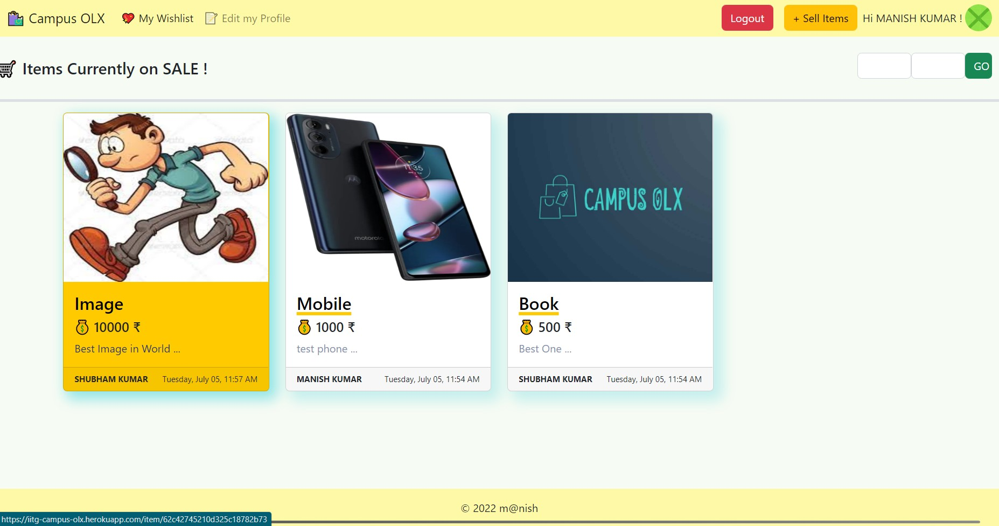
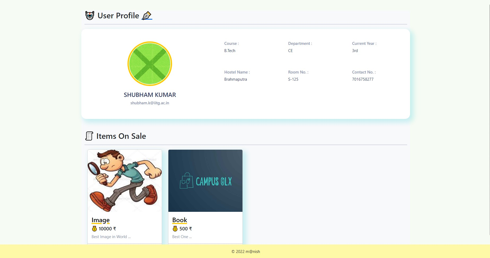
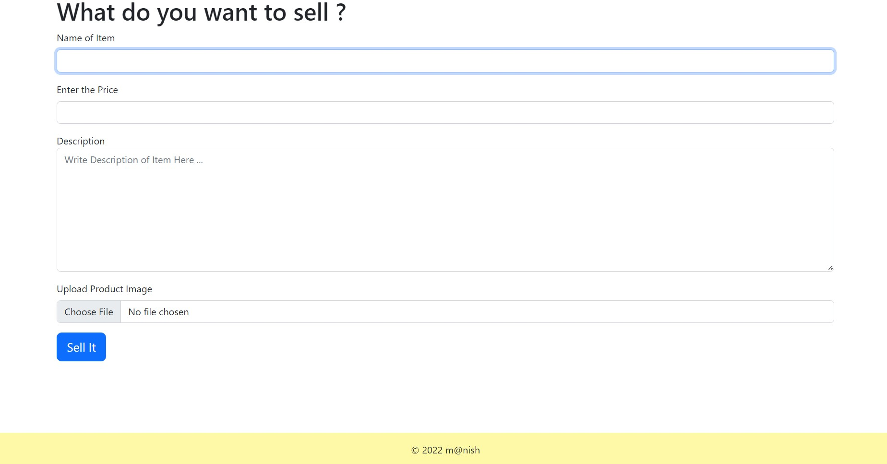
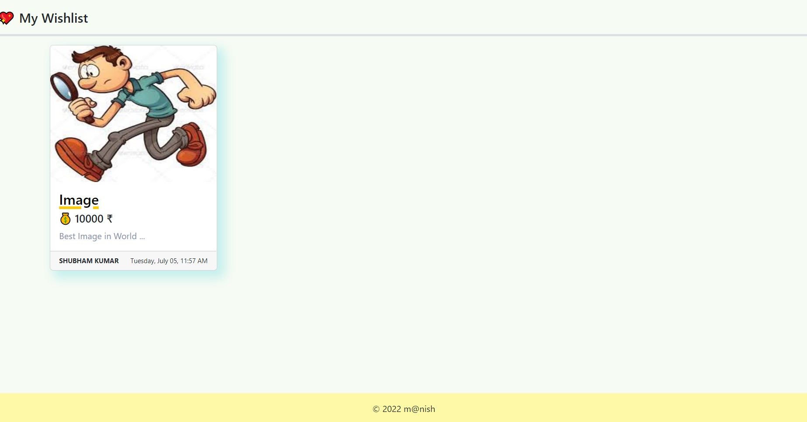

<h1 align="center">
🛍 Campus OLX
</h1>
<p align="center">
<b>MongoDB | Express | EJS | Node</b>
</p>

> Campus OLX is an online platform that allows users to buy and sell old items within the campus.

## 📺 Live Demo
This project is deployed on [~~Heroku~~](https://iitg-campus-olx.herokuapp.com/) or
Check out its Working Proof [here.](https://drive.google.com/file/d/1iIIowl7md2BPDr3LZegH_OXWRtx97-CZ/view?usp=sharing)

## 🕵️‍♀️ About the Project
**Problem Description :**

Someone has completed his/her degree and is going to leave campus but don't know what to do with the personal belongings like cycle, mattress, electric Kettle etc or there is someone who is new in the campus but don't want to spend a lot of money on buying a new cycle. The current situation is that every student receives a lot of e-mails regarding old items listed on sale by someone, whether he/she wants or not. This often leads to the problem of filling of our mailbox and we may face problem while searching for other important e-mails.

**Solution :** 

This project is an attempt to solve the above problem by creating a pulic platform where users can list there old items on sale and the interested buyers can contact the seller directly. This will prevent our outlook inbox from being filled by unwanted e-mails and also organize the whole process of buying and selling of old items. 


## 🧩 Main Features
* Home Page listing all items currently on sale.
* Authentication using Outlook OAuth.
* Filtering items by its price range.
* Adding and removing items to/from wishlist.
* Othe features include :
    * Option to post comments.
    * Seller Info page.
    * Option to mark item as sold by the seller.
    * Making an offer to the seller using whatsapp.

## 💻 TechStack Used
* [MongoDB](https://www.mongodb.com/)
* [Express](https://expressjs.com/)
* [EJS](https://ejs.co/)
* [Node.js](https://nodejs.org/en/)
* HTML
* CSS
* JavaScript

## ⭐ Getting Started Locally

### Prerequisites

- [Node.js](https://nodejs.org/en/download/)^16.15.1
- [MongoDB](https://www.mongodb.com/try/download/community)^5.0

### Installation
 
 ```sh
 $ git clone https://github.com/The-DefaultCube/campus-olx/
 $ cd campus-olx
 $ npm i
 ```
### Environment Variables
1. Register app in application registration potal for [authentication.](https://www.passportjs.org/packages/passport-outlook/) 
2. Register on [Cloudinary](https://cloudinary.com/) for handling image uploads.
3. Create a `.env` file and add the following :
```js
CLOUDINARY_CLOUD_NAME="YOUR_CLOUDINARY_CLOUD_NAME"
CLOUDINARY_API_KEY="YOUR_CLOUDINARY_API_KEY" 
CLOUDINARY_API_SECRET="YOUR_CLOUDINARY_API_SECRET"
OUTLOOK_CLIENT_ID="YOUR_OUTLOOK_CLIENT_ID"
OUTLOOK_CLIENT_SECRET="YOUR_OUTLOOK_CLIENT_SECRET"
EXPRESS_SESSION_SECRET="YOUR_EXPRESS_SESSION_SECRET"
MONGO_DB_PASSWORD="YOUR_MONGO_DB_PASSWORD"
```

## 🖼️ Screenshots
<table>
  <tr>
    <td><b>Home Page</b></td>
    <td><b>Item Page</b></td>
  </tr>
  <tr>
    <td></td>
    <td></td>
  </tr>
  
  <tr>
    <td><b>Seller-Info Page</b></td>
    <td><b>Selling Items Page</b></td>
  </tr>
  <tr>
    <td></td>
    <td></td>
  </tr>
  
  <tr>
    <td><b>Wishlist Page</b></td>
  </tr>
  <tr>
    <td></td>
  </tr>
</table>


## 📩 Contact
- Contact me : manish0307kumar@gmail.com
- Project Link : https://github.com/The-DefaultCube/campus-olx/


## 🙏 Thanks :)
```js
if ( youLovedProject() ) {
 starIt();
}
```
